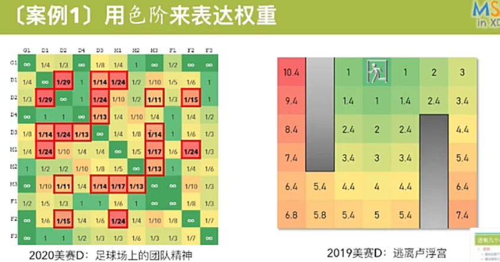
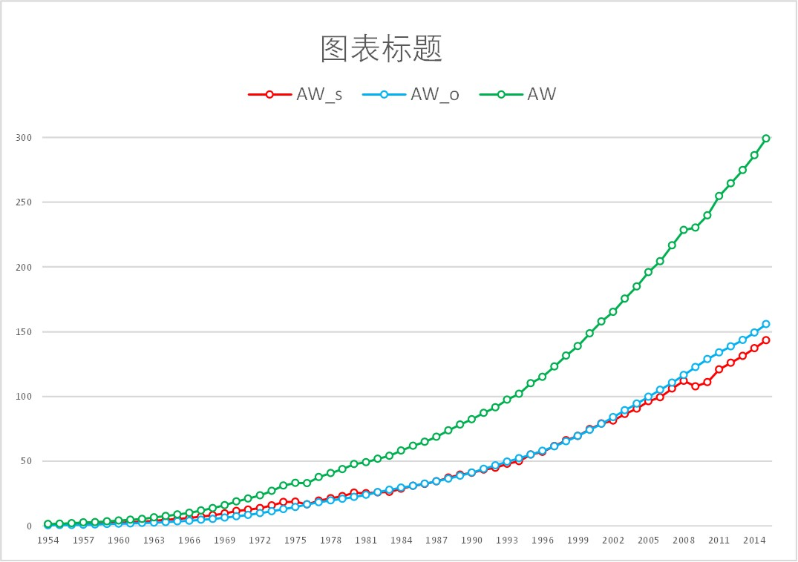
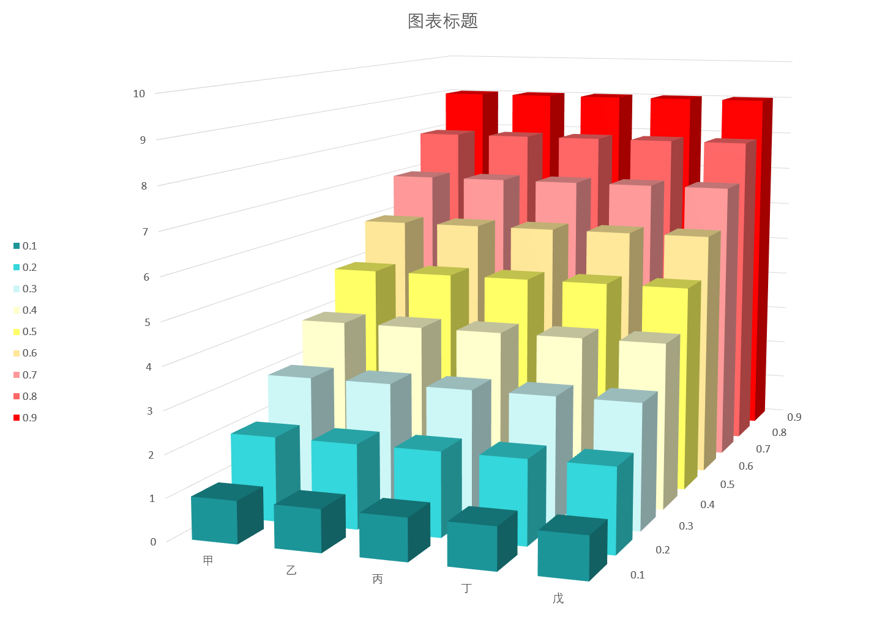

# 美赛准备笔记

## Advisor任务

1. 2月4日早上6点，比赛开始
2. 输入control number、团队姓名，选择问题
3. 下载summary sheet，作为论文首页
4. 2月9日上午9点，比赛结束
5. 使用电子邮件发送论文，主题为control number，文件名为control number.pdf，不要交non-solution
6. 比赛结束后，登陆网站，确认已经提交

## 分工

1. 队友A完成建模，并且要写建模部分论文
2. 对整个论文最熟悉的队友参与论文的summary、总结和引言的写作
3. 排版由一位同学专门负责
4. 边写边译

## 论文要求

1. 撰写者要熟悉论文结构，可以从历届的论文入手分析
2. 第一页为summary sheet
3. 正文不超过25页，2019年的要求是20页之内
4. 页眉有所在页数和control number的要求
5. 正文不能出现个人信息
6. 字体至少为12点可读
7. 专业词汇可以用欧路词典

## 论文结构

本说明立足于整个pdf文件给出结构

pdf要加上书签，不知道这个生成还是手动加上去的

题目布置的任务可以分成建模（modeling）和讨论（discussion）

### Summary

1. 首先，可以拿模型起一个标题，这个模型基于……，高大上，即A Model Based on XXX
2. restate the background，然后最后一句话引出工作
3. 顺着tasks，使用firstly、secondly，对完成的tasks逐一陈述
4. 设计了什么模型，基于什么设计的，基于……可顺着problem里的提示写
5. 取得了何种结果，这种结果具体是什么，可以直接用数字给出
6. **设计的模型，基于的方法，取得的成果**，用黑体加粗

### Contents

1. Introduction

   1. Background
   2. restatement of the problem/ourwork
2. Assumptions and Notation
3. the name of 1st task/the name of model
4. Implementation of the model/Case Studies
5. Discussion Tasks(if exists)
6. Sensitivity Analysis
7. Strongnes and Weakness
8. Conclusion/Adivce
9. Memo
10. References
11. Appendices

## 读题

1. 探究出赛题的老师，是如何想的，从中找到建模的思路(解决问题)
   就是解决问题的办法，题中会给很多提示。
2. 提取出关键字
3. 查找相关文献，扩展思路，以及当下解决这个问题的办法
4. 整理出解决问题的思路（包括数据的查找、方法的解决)
5. 翻译题目，谷歌翻译
6. 没思路查文献，有思路选最难的
7. 2~3个小时查文献大家应该把文献都汇总，整理成，队友A-xxx，放到word里面
8. 维基百科、谷歌学生、百度学术，直接查相关文献

## 建模流程

转载自[公众号司镜233的文章](https://mp.weixin.qq.com/s/mAjv4aPmIFHpf1EJdBvscQ)

### 分析问题

**（1）根据已知信息的多寡，将问题分为：**

内部规律比较清楚：**白箱模型【大学生建模比赛用】**

知道模型的信息，不同变量之间的关系

对于未知参数，可以通过某种方式估算这些参数

其中的规律很少为人们所知：**黑箱模型**

神经网络：模型不透明

非线性系统识别NARMAX（带有异质输入的非线性自回归移动平均模型）：模型透明

**（2）主观信息：基于直觉、经验或专家建议**

将主观信息纳入模型，很有用【理论依据：贝叶斯统计】

先验概率分布（可以是主观的），然后根据经验数据更新分布

比如，抛硬币正面朝上的概率

### 简化问题

- 所有的模型都是错的，但有些很有用
- 简单vs准确，简单是最可取的

增加复杂度可以增加真实性，但会使模型难以理解和分析，引起复杂的计算、数值不稳定等问题。

建模过程中，每个单独的部分都会在模型中引起一定量的方差，所以将模型近似到合理的大小，可以让模型更健壮。

（1）判断哪些核心部件必须保留，哪些可以简化！！！！！

模型是将现实世界抽象

（2）假设非常有必要

实际的情况非常复杂，所有的模型都不是准确的，只是近似

族群遗传学模型，假设族群固定大小

计量遗传学模型，假设连续形状

（3）拟合

模型过于适合数据，就会失去了将其推广到一个极端，缺乏观察到新事件的能力

### 创建模型

（1）实际因素转化为变量

（2）分析变量的关系，用合理的数学式表达

（3）根据实际问题，选取合适的数学框架：算法，建模方法

（4）计算机模拟编程，求出结果

### 分析结果

计算结果解释实际问题，并分析结果的可靠性

技巧：信息可视化

### 模型评估

评估给定的模型，是否准确地描述了系统是否适合实验测量、或其他经验数据

A: 将数据，分为不相交的两个子集：训练数据、验证数据

训练数据用于估计模型参数，验证数据用于检验模型——**交叉验证**

B: 定义度量，计算实际数据与预测数据之间的距离

（决策理论，经济模型中常用损失函数）

C: 测试参数的有效性比较简单，测试模型的有效性会比较困难

微分方程模型，统计模型，非参数统计工具，最小假设

## 数据的收集和处理

### 收集数据

[数据网站：our world in data](https://ourworldindata.org/plastic-pollution)，具体过程可见[视频](vid\get_data-ourworldindata.org.mp4)。

### 处理数据

[标准化方法](https://www.cnblogs.com/chaosimple/archive/2013/07/31/3227271.html)

[利用pandas读取csv并转换成list](https://blog.csdn.net/cindy_1102/article/details/95450961)

[pandas的read_csv方法中usecols参数读取指定的列](https://blog.csdn.net/fisherming/article/details/97616053)

### 曲线拟合

给出x-y的散点图，可以对其进行对数/多项式拟合，具体方法见百度知道上[莱昂纳德_欧拉的回答](https://zhidao.baidu.com/question/233760790)。

若追求更高精度的拟合，可以使用这个[在线工具](http://www.qinms.com/webapp/curvefit/cf.aspx)，将Excel中数据复制粘贴进去即可。

## 算法及模型

### 聚类和判别

#### 判别分析

LDR，先有个training set，然后对于输入可以进行判别。

代码见[此博客](https://blog.csdn.net/qq_41686130/article/details/81870795)，令人疑惑的是没有教程。

如果有SPSS的话，可以看这个[Bilibili上的教程](https://www.bilibili.com/video/BV1Zb41127ef?p=1)。

#### K-means

这个就别想用Excel进行分析了

[介绍](https://blog.csdn.net/garfielder007/article/details/51476104)

[csdn上的python代码](https://blog.csdn.net/u011913612/article/details/78638315)

[Bilibili上的python代码](https://www.bilibili.com/video/BV1Vg4y187hh)

[使用SPSS的Bilibili教程](https://www.bilibili.com/video/BV1As411P7fM)

### 评估/打分算法

#### AHP层次分析法（Analytic Hierarchy Process）

[利用Excel进行层次分析法](https://www.bilibili.com/video/BV1hK411G76S)

#### 熵权法（Entropy Weight Method）

熵值法，就是有多个评价维度，有的评价维度大家差距很大，那么这个维度的权重就大。

[对熵值法的理解](https://blog.csdn.net/amy_diary/article/details/53672814)

[利用Excel进行熵权法分析](https://www.bilibili.com/video/BV1qt4y1276a)

利用Mpai直接进行傻瓜式分析：

[教程](https://www.bilibili.com/video/BV1Ea411A7dR)与[网址](http://127.0.0.1:49321/dsp/#/)

#### PSR Model

PSR模型指的是Pressure-State-Response Model，即压力-状态-响应模型。

是将收集到的各个指标分类，然后再赋以相应的权重，最后求值。

具体可以参考[百度文库上的的一个案例](https://wenku.baidu.com/view/6496bca8cc2f0066f5335a8102d276a201296055.html)，我亦做了[备份](Attachments/PSR模型及案例.pdf)。

### 相关性分析

#### 灰色相关性分析

给出各个维度数据对于某个特定维度数据的相关性，代码和介绍见[这篇博客](https://blog.csdn.net/weixin_39594447/article/details/88145028)。

也可以用在线SPSS进行分析，具体过程可参考Bilibili上的这个[视频](https://www.bilibili.com/video/BV1TE411F7c5)。

## 自定义参数

1. 总和型参数：total
2. 平均型参数：per capita
3. 所占百分比型

## 画图

### 流程图

[使用drawio画流程图](https://www.bilibili.com/video/BV1ZA411H7cY/)

### 矩阵权重图

[矩阵色阶权重图绘制，从7:00开始看](https://www.bilibili.com/video/BV1c5411W7U9)

### 折线图

推荐是写入csv文件中，然后转成xlsx，再绘图。

可以参考这个视频：[在Excel中绘制折线图](https://www.bilibili.com/video/BV1PN411o722/)，画完以后，导出的过程可以参考此[百度经验](https://jingyan.baidu.com/article/86fae3461c9ccd3c49121a07.html)。

在一张大画布上画数个图，可以参考[matplotlib中的subplot的用法](https://www.cnblogs.com/caizhou520/p/11224526.html)

### 三维柱状图

三维柱状图用于分析多个因子对结果的趋势

绘制方法可见Bilibili：

[使用Excel绘制三维柱状图-1](https://www.bilibili.com/video/BV1j5411J7D5)

[使用Excel绘制三维柱状图-2](https://www.bilibili.com/video/BV1BU4y1471a)

## 杂项

### 对数正态分布

[百度百科关于对数正态分布的叙述](https://baike.baidu.com/item/%E5%AF%B9%E6%95%B0%E6%AD%A3%E6%80%81%E5%88%86%E5%B8%83/8976782)

[维基百科关于对数正态分布的叙述](https://zh.wikipedia.org/wiki/%E5%AF%B9%E6%95%B0%E6%AD%A3%E6%80%81%E5%88%86%E5%B8%83)
